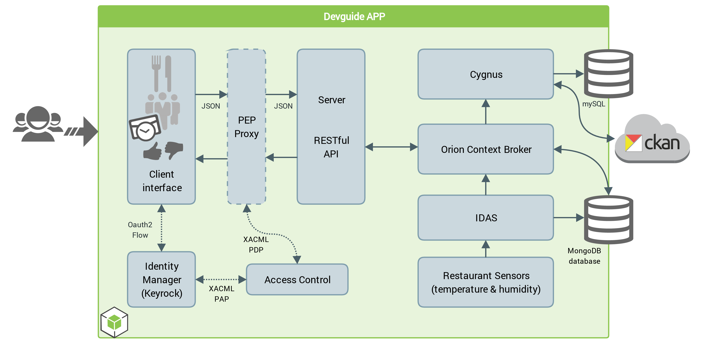
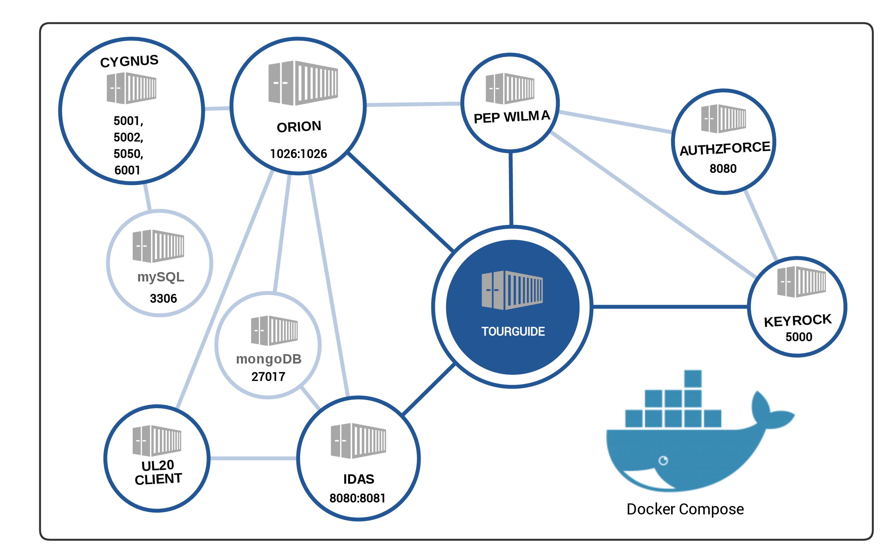

# FIWARE Tour Guide Application

FIWARE provides an enhanced OpenStack-based cloud environment plus a rich set of open standard APIs that make it easier to connect to the Internet of Things, process and analyse Big data and real-time media or incorporate advanced features for user interaction.

When the first version of the [FIWARE Tour Guide](http://fiwaretourguide.readthedocs.org) was created, it was based on some fictitious use cases that facilitated the description of the main functionalities offered by the different GEs or Chapters in FIWARE. Soon it was detected the necessity of enabling direct experimentation with the technologies to improve learning processes. As a result, it was decided to build a tutorial application aimed at supporting the Tour Guide use cases, enabling developers to follow a “try and tweak” learning process.

The FIWARE Tour Guide Application is a reference application aimed at teaching and demonstrating how to combine different Generic Enablers (GEs), in order to create a smart context-aware application. It exploits the capabilities offered by Docker Containers provided by FIWARE GEris. Furthermore, the application allows an incremental instantiation and linkage of different FIWARE GEs, as it is based on docker compose.

## Approach

The first step taken to build the FIWARE Tour Guide application was to think up a rich use case: the  smart management of a big restaurant franchise, including reservations, reviews and all the parameters which have to do with managing each restaurant on a day by day basis.
For this purpose, data coming from the Open Euskadi (Basque Country Government) open data portal was used to generate a docker image with a set of restaurants, reviews and reservations. All this process was automated for the benefit of the end user who will be able to try and tweak with mock data.

## Application functionalities

The list below summarizes the main functionalities currently offered by the smart restaurant (Tour Guide) application:

+ 	Different user profiles (customer, restaurant manager, franchise manager) and functionalities per profile
+  	Admit Customer reservations in accordance with current occupation and reservations made.
+  	Register customer reviews according to different criteria (service, food, etc.).
+ 	Real-time control of different parameters at each restaurant location (occupation, temperature, etc.).
+  	Short time historic data of the different parameters monitored. Publication of open data concerning the most relevant information about the different restaurant locations.
+  	Web user interface to monitor information about restaurants.

## Architecture

The figure below describes the architecture of the Smart Restaurant application, which integrates a number of GEs:

- IoT GEs: Backend Device Management - IDAS. It is in charge of connecting IoT devices (temperature & humidity) using the UL20 client. This component translates UL20 client requests into NGSI context entities, enabling querying and subscribing to sensor data.
- Data GEs: Orion Context Broker. It is responsible for managing all the application context information modelled as NGSI entities (Restaurant, Reservation, Review, …).
Cygnus, part of the Cosmos ecosystem, is responsible for persisting historical context data in a target backend (MySQL or Hadoop) or as open data (CKAN). Cygnus is connected to Orion Context Broker through the subscription/notification interface.
- Security GEs:
  	- Authorization PDP - AuthZForce, provides an API to get authorization decisions based on authorization policies.
    - IDM KeyRock covers a number of aspects involving user profile management, OAuth authentication, authorization & trust management, Single Sign-On (SSO) to service domains and identify federation towards applications. It interacts with AuthZForce.

Finally, through a front-end application, managers get access to restaurants under his duty and restaurant customers can make and browse reviews, or even ask for reservations.

*
 Figure 7 .- Architecture of the Tour Guide Application 
*

##	Implementation approach

To this aim we have connected, using Docker-compose, different GEs deployed on different containers. Docker-compose enables the creation of a complete environment just by writing a .yml (or .yaml) schema file. In that file several parameters are defined: containers to be created, volumes to share data, how to link containers, ports exposed and environment variables that will be used to configure the Generic Enablers. . The docker-compose file created for the Tour Guide Application defines the scenario described by the image below. This configuration has all the advantages of using isolated environments and exposing each generic enabler from a desired port.
The Tour Guide Application uses the official Docker from the GEris and has contributed to debugging or polishing them.

*
 Figure 8 .- Docker container structure 
*

## 	Development approach

[This repository](https://github.com/fiware/tutorials.TourGuide-App) holds all the code of the Tour Guide Application. It has been released using the MIT License. Contributions from external developers are welcome. The development process follows usual Github workflows with pull requests, reviews and code landing. The application code has been developed using Node.js and HTML5 technologies. The Travis CI tool is used for running all tests and ensuring quality.

