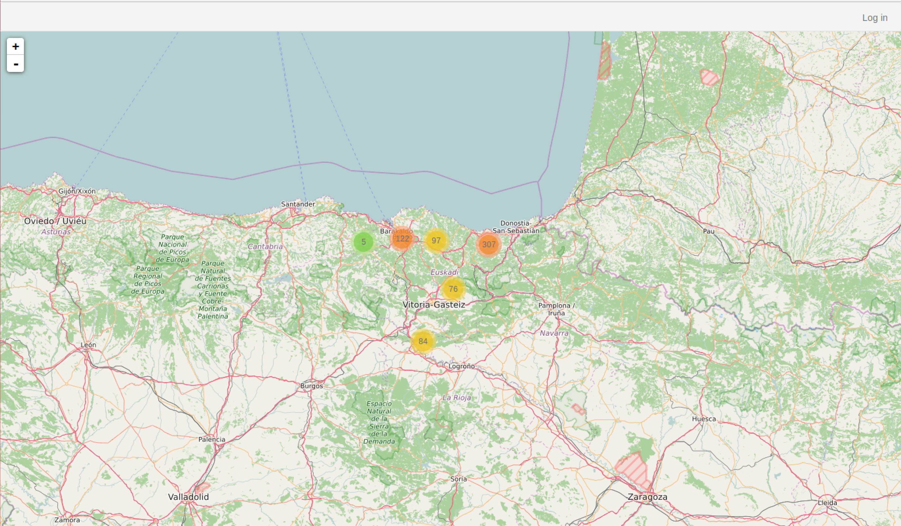
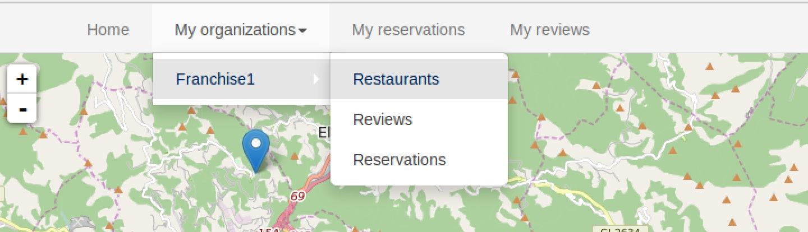
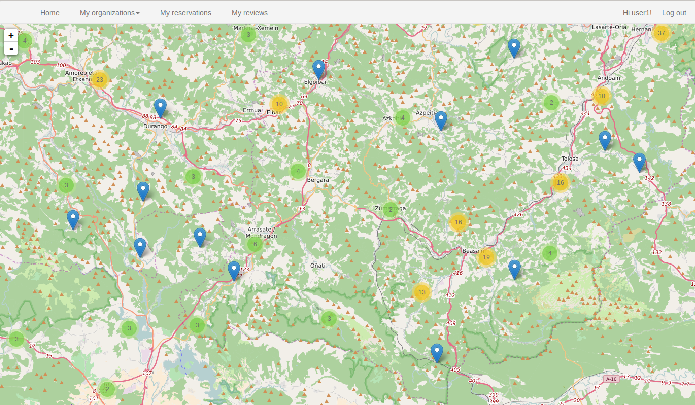
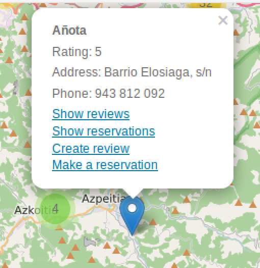
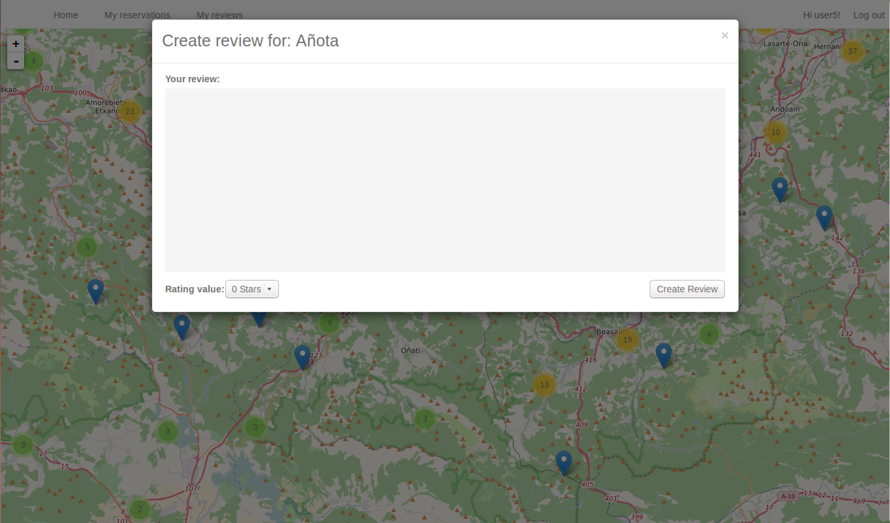
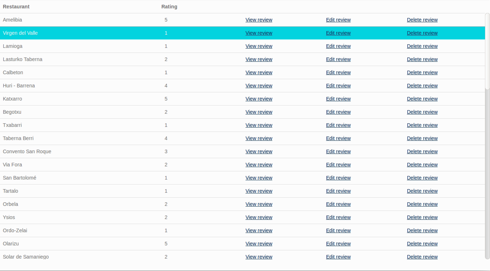
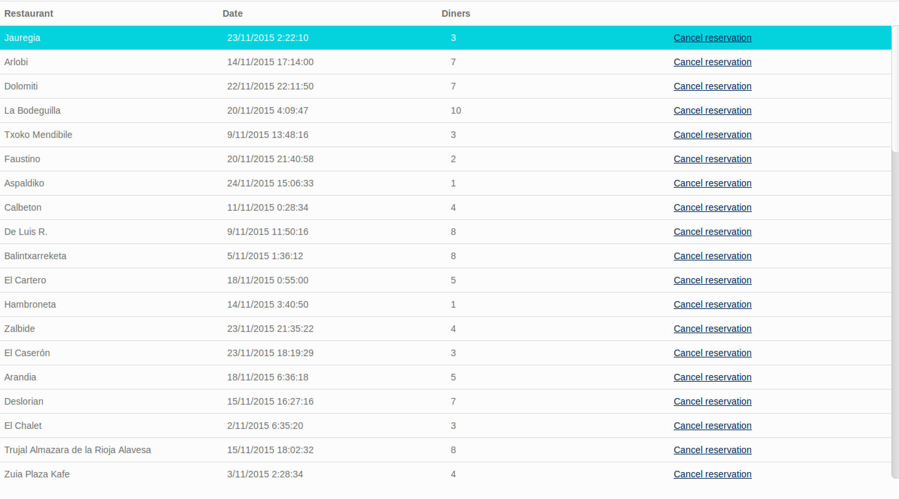
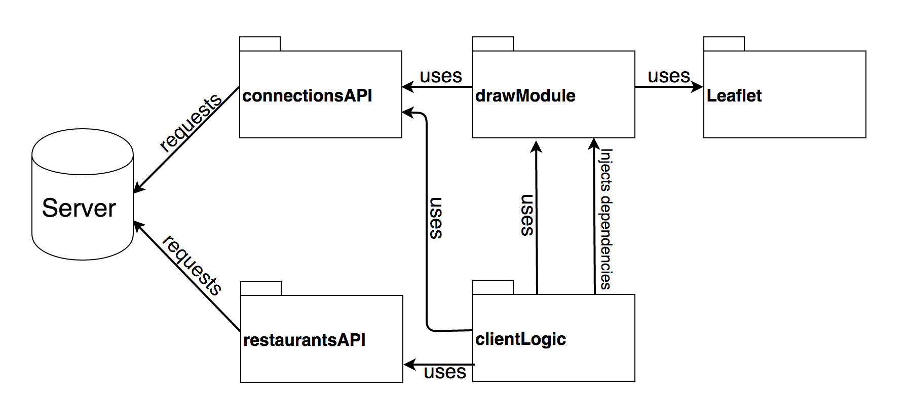
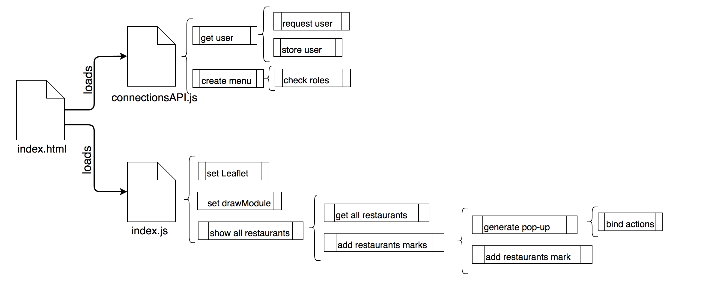

## Running the front-end application

For running the front-end application, assuming you are on the folder where you downloaded the source code, follow these steps:

 * Launch the application using the command line interface (from now on CLI) with: `./tour-guide start`
 * Provide user, roles and permissions on Keyrock with `tour-guide configure keyrock`
 * Get the Oauth credentials from Keyrock and add them to the Tourguide configuration with `./tour-guide configure oauth`
 * Configure the hosts file in order to run the images using their aliases with `./tour-guide configure hosts`


After performing all the above steps, the front-end application is ready to be used. If you open `http://tourguide/client` in your web browser you should see something like:

[](img/main-app-not-logged.png)

    You can log in using, for instance, the user `user1@test.com` with the password `test`. Once logged in, you can see a new menu at the top of the page:

    * **Home**: Return to the main view where all restaurants are displayed.
    * **My franchises** (only available for users that belong to a franchise): Display information filtered by user franchises. The sub menu entries available for each franchise are:
        * **Restaurants**: Filter restaurants shown in the map by the selected franchise.
        * **Reviews**: Display all reviews written about the selected franchise.
         * **Reservations**: Display all reservations of the selected franchise.
     * **My reservations**: Display a list with all the reservations made by the logged user.
     * **My reviews**: Display a list with all reviews written by the logged user.

[](img/organizations-menu.png)


### Front-end application main view

In this section, all restaurants are represented in the map, in order to provide a clean view avoiding restaurant markers overlaps, they are grouped using a clustering approach. If you zoom in or click on a group, the restaurants or smaller groups are shown. Each group has a number that represents how many restaurants are collapsed. You need increase the zoom level or click on the groups until you get the desired restaurant. The following image shows a representation with restaurant marks and groups:

[](img/zoomed-restaurants.png)


If a restaurant mark is clicked, a pop-up with its general information and some operations is shown:


[](img/restaurant-popup.png)

“Show reviews” and “Show reservations” options are always displayed. You need to be logged in to see the “Make a reservation” option and not to belong to any franchise in order to create a review. If any of this options are clicked, a modal window comes up displaying the requested information or providing the input mechanism to perform the operation.

[](img/create-review.png)


### Reviews filtered by user or by franchise

Unlike how restaurant reviews are shown, reviews filtered by user or restaurant are displayed using a specific section.
All reviews are listed as depicted in the following image:


[](img/client-reviews.png)


“Edit review” and “Delete review” options are only available in “My reviews section”.


### Reservations filtered by user or by organization
This case is similar to the reviews case, while restaurant reservations are shown as pop-ups in the main view, reviews filtered by the logged user or by organization are listed in an specific section:

[](img/client-reservations.png)


## Front-end application structure

The front-end application is built using HTML5, CSS and JS. These are the most important modules:

* **restaurantsAPI.js**: This module performs requests against the server API.
* **connectionsAPI.js**: This module contains the functions related to the user session.
* **drawModule.js**: This module contains the methods to build the UI.
* **clientLogic.js**: This module specifies the application behavior. It also interconnects the other modules.
* **leaflet.js**: JS library for rendering the interactive map.

[](img/front-end-modules.png)


### restaurantsAPI.js
This module is responsible for performing most of the requests between the front-end application and the server API. In its internal configuration the API endpoint, where all requests will be sent, is defined:


```
...
var baseURL = 'http://tourguide/api/orion/';
...
```

All functions provided by this module (except `simplifyRestaurantsFormat`) accept two callback functions, one to process the result data in case of success and another to process possible errors. For example, if `getAllRestaurants` is called as following:


```
getAllRestaurants(func1, func2);
```

If the API request responds with `200 OK`, the `func1` is called using the response as input parameter. However, if the API gets an error, for example a `404 NOT FOUND`, the `func2` is called instead.

The functions provided by this module are:

 * `getAllRestaurants(sucessCallback, errorCallback)`: This function is used for retrieving all restaurants.
* `getOrganizationRestaurants(organization, sucessCallback, errorCallback)`: This function retrieves restaurants like `getAllRestaurants` but filtered by organization.
* `getOrganizationReviews(organization, sucessCallback, errorCallback)`: Retrieves all reviews written about all the restaurants of the specified organization.
 * `getOrganizationRservations(organization, sucessCallback, errorCallback)`: Retrieves all reservations of the specified organization.
 * `getRestaurantReviews(restaurantName, sucessCallback, errorCallback)`: Retrieves all reviews about the specified restaurant.
 * `getRestaurantReservations(restaurantName, sucessCallback, errorCallback)`: Retrieves all reservations of the specified restaurant.
 * `getUserReviews(username, sucessCallback, errorCallback)`: Retrieves all reviews written by the specified used.
 * `getUserReservations(username, sucessCallback, errorCallback)`: Retrieves all reservations made by the specified user..
 * `getReview(reviewID, sucessCallback, errorCallback)`: Retrieves a specific review.
 * `createNewReview(restaurantName, ratingValue, reviewBody, sucessCallback, errorCallback)`: Creates a new review for  the specified restaurant using the passed rating value and review content.
 * `updateReview(reviewId, ratingValue, reviewBody, sucessCallback, errorCallback)`: Updates the specified review using the new provided values.
* `deleteReview(reviewId, sucessCallback, errorCallback)`: Deletes the specified review.
 * `createNewReservation(restaurantName, partySize, reservationDatetime, sucessCallback, errorCallback)`: Creates a new reservation for the logged user at the specified restaurant and at the given date.
 * `cancelReservation(reservationId, sucessCallback, errorCallback)`: Cancels the specified reservation.
* `simplifyRestaurantsFormat (restaurants)`: Takes an array of restaurants and return another one  with the restaurants simplified. The expected format for the input array is the same than the format used for `getOrganizationRestaurants` or `getAllRestaurants`. This function also filters out restaurants with invalid coordinates.


### connectionsAPI.js

This module manages the user information and the top menu. It has information about roles and permissions. The module provides the following functionalities:

 * `loginNeeded(action)`: Executes the specified function only if the user is logged in.
 * `loggedIn(userInfo)`: Stores the user information in the web browser `local  storage` and create the top menu using the user information.
 * `notLoggedIn()`: Removes the user information from the web browser `local storage` if it is recorded and create the top menu with the **log in** option.
 * `hasRole(userInfo, roleName)`: Returns true if the specified user has the specified role.
 * `getUser()`: Function that returns the information about the logged user.
 * `roles`: object with the available roles.

This module also executes an init function that makes a query to the server API in order to know the user If such request is successful, the init function executes the `loggedIn` function creating the menu and storing the user information. Otherwise, it executes `notLoggedIn`, removing all information all previously stored user data and creating the menu.


### drawModule.js

This module performs most of the operations strictly related to the UI. To use this module, you need to add the Leaflet, jQuery, jQueryUI and timepicker libraries. Unlike the other modules, this one needs to be initialized with the actions that will be performed when an event is triggered. This actions can be set up using the following functions:

 * `setViewReservationAction(action)`
 * `setViewRestaurantReviewsAction(action)`
 * `setCreateNewReviewAction(action)`
 * `setCreateNewReservationAction(action)`
 * `setGetReservationsByDateAction(action)`
 * `setViewReviewAction(action)`
 * `setShowEditReviewAction(action)`
 * `setUpdateReviewAction(action)`
 * `setCancelReservationAction(action)`
 * `setDeleteReviewAction(action)`


The functionalities provided by this module are:

* `addRestaurantstoMap(restaurants)`: This function adds a mark for each input restaurant to the Leaflet map. Each mark contains the relevant information about a restaurant and the available actions that users can perform over the restaurant.
* `setPopupTitle(title)`: Sets the title of the modal window.
* `setPopupContent(contentDiv)`: Replaces the modal window content with the specified div.
* `createReviewsDiv(reviews)`: Creates an element containing a list with the information of each input review.
* `createReservationsDiv(reservations)`: Creates an element containing a list with the information of each reservation.
* `createReviewsTable(reviews)`: Creates a table containing the basic informat information of each review. It also generates the **View review**, **Delete review** and **Update review**options.
* `createOrganizationReviewsTable(reviews)`: It is like createReviewsTable but it does not create the **Delete review**and **Update review** options. Besides, the reviews are filtered by organization.
* `createReservationsTable(reservations)`: Creates a table containing the information of each input reservation. It also generates the **Cancel reservation** option.
* `createReviewForm(restaurantName, review)`: Generates a form that creates a review for the specified restaurant. If review is passed, the form is prepared to be initialized with its values and form action is set to update review instead of create review.
* `initializeReviewForm(review)`: Initializes a review form  that was previously created by `createReviewForm`.
* `createViewReviewDiv(review)`: Creates a div containing all the information about a review.
* `openPopUpWindow()`: Opens the modal window.
* `closePopUpWindow()`: Closes the modal window.

### clientLogic.js

This module contains the client application behavior. It uses the `connectionsAPI` module for retrieving the user information, the `restaurantsAPI` module for performing requests against the server API and the `drawModule` for rendering the UI. This module also injects dependencies to the `drawModule`. This allows `drawModule` to know which actions should be executed from the UI.
This module contains the following methods:

* `showAllRestaurants()`: Performs a request for retrieving all restaurants and render them into the Leaflet map.
* `showOrganizationRestaurants(organization)`: Performs a request for retrieving all restaurants of an organization and render them in the leaflet map.
* `showReservationsByOrganization(organization)`: Performs a request retrieving all the restaurant reservations of the organization and displays them using a list.
* `showRestaurantReviews(name)`: Retrieves all reviews of the specified restaurant and displays them using the modal window.
* `showRestaurantReservations(name)`: Retrieves all reservations of the specified restaurant and displays them using the modal window.
* `showReviewsByUser(username)`: Retrieves all the reviews written for the specific user and creates a table displaying them.
* `showReviewsByOrganization(organization)`: Gets all the reviews of the organization restaurants and displays them.
* `createNewReview(name, rating, description)`: Creates a new review for the specified restaurant.
* `createNewReservation(name, partySize, time)`: Creates a new review for the specified restaurant.
* `updateReview(reviewId, rating, description)`: Updatse the specified review.
* `deleteReview(reviewId)`: Deletes the specified the review.
* `showReservationsByUser(username)`: Retrieves all the reservations of the specified user and display them using a table.
* `getMyReviews()`: Calsl `showReviewsByUser` using the logged user information.
* `getMyReservations()`: Calls `showReservationsByUser` using the logged user information.
* `setUpDrawModule()`: Initializes all the actions to be performed from the UI.


## How the front-end app works
All pages of the front-end application include the `connectionsAPI` module. This module executes an init function that tries to retrieve the user information performing a request against the server API endpoint `tourguide/client/user`. If the request is successful, the user information is stored for further operations and the top menu is created. If the user is not logged in, the request will fail, all user information previously stored is deleted and the login menu is generated.

In order to generate the top menu when the user is logged in, the `connectionsAPI` checks the user roles and the user organizations. For example, **My organizations** menu entry is only generated if the user belongs to at least one organization.

```
...
if (organizations.length > 0) {
        var myOrganizationsLi = document.createElement('LI');
        myOrganizationsLi.className = 'dropdown';
...
```

The init file of the main view sets up the Leaflet map centering the view in Vitoria, setting the zoom level to 8 and adding the Open Street Map layer:

```
  map = L.map('map').setView([42.90816007196054, -2.52960205078125], 8);

  // set tile layer
  L.tileLayer('http://{s}.tile.osm.org/{z}/{x}/{y}.png', {
    attribution:
      '&copy; <a href="http://osm.org/copyright">OpenStreetMap</a> contributors'
  }).addTo(map);
```

After the map creation. the init files initializes the `drawModule` and displays all restaurants:

```
  clientLogic.setUpDrawModule();
  clientLogic.showAllRestaurants();
```

The `clientLogic.showAllRestaurants` function uses `restaurantsAPI.getAllRestaurants` to retrieve the restaurants and `drawModule.addRestaurantstoMap` to add the restaurants to the map.

`drawModule.addRestaurantstoMap` iterates over the restaurants and creates a mark with a pop-up for each of them. The mark contains basic information about the restaurants like its address, telephone number, average rating, etc. The mark also displays available actions for the restaurant, these actions are binded using the methods that were injected by `clientLogic.setUpDrawModule()`. So, for example, if the **Show reviews** option is clicked the `clientLogic.showRestaurantReviews` is called. The following image explains the processes involved, which are executed in order from top to bottom.

[](img/draw-restaurants-involved-process.png)

**My reviews** section displays reviews written by the logged user. In order to check that the user is logged inthe `connectionsAPI.loginNeeded` function is called with `clientLogic.getMyReviews()` as callback method. In other words, if the user is logged in the `clientLogic.getMyReviews()` is executed and if the user isn’t, an error message requesting login is shown.

```
// only gets reviews if the user is logged
  connectionsAPI.loginNeeded(function() {
    clientLogic.getMyReviews();
  });
```

The  `clientLogic.getMyReviews()` function uses `connectionsAPI.getUser()` to get the username, and then displays the user reviews using `clientLogic.showReviewsByUser`. Similarly to `restaurantsAPI.getAllRestaurants`, this function retrieves the user reviews using `restaurantsAPIgetUserReviews` and creates the reviews table using `drawModule.createReviewsTable`.


The rest of the sections follows the same structure as **main view** and  **My reviews** sections.


